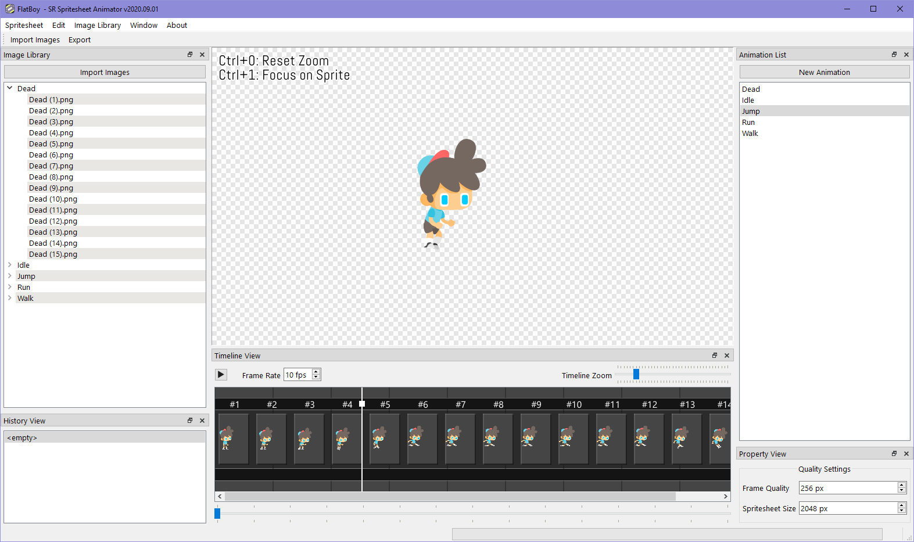

---

## About

SR Spritesheet Animator is a tool for generating spritesheets and organizing animations from a list of images. The C animation runtime can be integrated into game engines to allow for live editing of the animations for instant feedback.

## Using the Tool

## Integration

The spritesheet animation API is meant to be integrated into a custom engine
to allow for editing of animations which is then live reloaded for fast
iteration times.

## Architecture

The program creates a local TCP server that will be connected to automatically
by the client animation API 
